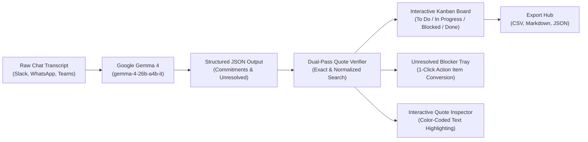

# ✦ Promise Tracker: AI Commitment & Accountability Board
### *Built for Challenge 01: Best Use of Gemma 4 (Gemini API)*

[](https://ai.google.dev/gemma)
[](https://ai.google.dev/)
[](https://streamlit.io/)
[](#-grounded-source-quote-verification)

> **Promise Tracker** uses a Google Gemma model to extract candidate commitments, deadlines, and unresolved blockers from chat conversations into an editable Kanban board. Source quotes are checked against the supplied transcript; model output is not guaranteed to be complete or correct.

---

## 🌟 The Challenge & The Problem

In high-velocity teams, crucial commitments get lost in the noise of group chats:
- *"I'll post the incident RCA by 2 PM."*
- *"Can you send the updated contract to legal before Friday?"*
- *"Who has the secondary AWS replica password?"*

Traditional task trackers require manual data entry that people forget to do. **Promise Tracker** bridges this gap: paste any chat thread, and Google's lightweight, open-weight **Gemma 4** model extracts:
1. **Who** promised **What** to **Whom**.
2. **By When** (explicit deadlines or timeframes).
3. **Status & Priority** (To Do, In Progress, Blocked, Done).
4. **Source quote check** (shows whether the returned quote matches text in the conversation; a match does not prove interpretation or extraction completeness).
5. **Unresolved Questions & Blockers** (critical inquiries that had no answer or owner).

---

## 🤖 Gemma 4 Model Identification

| Specification | Details |
| :--- | :--- |
| **Default Model** | **`gemma-4-26b-a4b-it`** |
| **Alternative Gemma 4 Endpoint** | `gemma-4-31b-it` |
| **Provider** | Google DeepMind / Google AI Studio via Gemini API |
| **Architecture** | Mixture-of-Experts (MoE) & Dense Transformer with 128k-256k context window and sliding-window attention |
| **SDK Integration** | Official Google GenAI Python SDK (`google-genai` v2.28+) |
| **Temperature** | `0.1` (Low variability; does not guarantee factual accuracy) |
| **Grounding Mechanism** | Exact and normalized source quote checks against the transcript |

Extraction sends one request to the selected model with a 45-second timeout; it does not retry or fall back to another model. The request uses JSON response mode and a schema for the expected commitment and unresolved-item fields, while the app still validates source quotes before displaying results.

### Why Gemma for Promise Tracking?
The app asks the selected model for structured commitment data and independently checks each returned source quote against the original transcript. This verification can identify unsupported quotes, but it does not prove that the model found every commitment or interpreted a verified quote correctly.

---

## 🏗️ Architecture & Workflow



---

## 💻 Gemma Integration in Code

Here is the core integration point using the official `google-genai` SDK:

```python
# gemma_client.py
from google import genai
from google.genai import types

class GemmaClient:
    def __init__(self, api_key: str, model_name: str = "gemma-4-26b-a4b-it"):
        self.client = genai.Client(api_key=api_key)
        self.model_name = model_name

    def extract_commitments(self, transcript: str, temperature: float = 0.1):
        prompt = f"{GEMMA_SYSTEM_PROMPT}\n\nTranscript:\n{transcript}"
        
        # Invoke Gemma model through Gemini API
        response = self.client.models.generate_content(
            model=self.model_name,
            contents=prompt,
            config=types.GenerateContentConfig(
                temperature=temperature,
                max_output_tokens=3000
            )
        )
        return parse_gemma_json_response(response.text, original_transcript=transcript)
```

---

## 🚀 Key Features

### 1. 📋 Commitment board and human review
- **4 Status Columns**: *To Do*, *In Progress*, *Blocked*, *Completed*.
- **Quick Move**: Move tasks between columns with a status control.
- **Priority & Assignee Badges**: Color-coded by person and urgency.
- **Correction form**: Edit the extracted commitment, owner, priority, dates, category, and review notes.
- **Review feedback**: Mark each extraction as *Correct*, *Incorrect*, *Incomplete*, or *Corrected* before relying on it.
- **Manual Task Creator**: Add commitments and explicitly verify a supplied quote against the transcript.

### 2. 📅 Due dates and search
- Assign an explicit calendar due date; natural-language deadlines are not silently converted into dates.
- Flag overdue, due-today, and upcoming tasks.
- Filter by assignee, status, priority, and deadline; search IDs, task details, source quotes, and notes.
- Show an in-app notification panel for overdue tasks and tasks due within seven days.

### 3. ❓ Unresolved Blockers & Questions Tray
- Highlights open questions that were asked in the chat but **never answered or assigned**.
- Features a **1-Click "Convert to Action Item"** button that promotes the blocker into a tracked commitment on the board.

### 4. 🔍 Source Quote Inspector
- Shows which returned source quotes match the transcript; this does not establish extraction completeness or interpretation accuracy.
- Renders the original conversation with **color-coded highlights** matching each team member's assigned promises.
- Hover over any sentence to see the exact Task ID and commitment metadata.

### 5. 📊 Accountability & Workload Analytics
- Real-time charts showing workload distribution per team member.
- Category breakdown (*Deliverable*, *Bug Fix*, *Review/Approval*, *Logistics*).
- Priority distribution (*High*, *Medium*, *Low*).

### 6. 📥 Multi-Format Export
- **CSV**: Open directly in Excel, Google Sheets, or Airtable.
- **Markdown**: Formatted task list ready for GitHub Issues or Notion.
- **JSON**: Machine-readable format for downstream automation.

### 7. ⚡ Built-In Realistic Benchmark Scenarios
Choose one of the three pre-loaded conversations above the transcript box and click **Load sample** to put it into the app:
1. **Sprint Retro & Incident Outage (Slack)**: Redis failure post-mortem, customer updates, and a missing MFA device.
2. **Client Design & Scope Review (Teams)**: Mobile app revisions, Apple Pay toggle, and change orders.
3. **Hackathon Project Planning (Discord)**: Final rush before submission, UI tasks, and Gemma integration.
Loading a sample does not alter the current board; a successful new extraction replaces it. The sample text is kept in the current app session until you run extraction. A Gemini API key is required to extract commitments; the sample text itself can be loaded and edited without one.

---

## 🛠️ Quick Start & Installation

### Prerequisites
- Python 3.10+ (tested on Python 3.14)
- Google Gemini API Key from [Google AI Studio](https://aistudio.google.com/) *(Optional for demo mode)*

### 1. Clone & Install Dependencies
```bash
git clone https://github.com/your-username/promise-tracker.git
cd promise-tracker
pip install -r requirements.txt
```

### 2. Configure Environment
Copy the example environment file:
```bash
cp .env.example .env
```
Add your key inside `.env`:
```ini
GEMINI_API_KEY=AIzaSy...
GEMMA_MODEL=gemma-4-26b-a4b-it
```
*(You can also paste your API key directly in the web app sidebar at runtime!)*

### 3. Launch the Application
```bash
streamlit run app.py
```
Open your browser to `http://localhost:8501`.
The transcript and board are saved locally in `saved_board_state.json`, so they survive a browser refresh or app restart. The 26B A4B model is selected by default; the 31B model is also available in the sidebar.

The app shows overdue and upcoming due-date notifications when the board is open. Notifications refresh when Streamlit reruns the app; they are not sent while the app is closed.

---

## 📁 Repository Structure

```text
├── app.py              # Main interactive Streamlit application
├── config.py           # Gemma model definitions, prompt templates & system instructions
├── extractor.py        # Pydantic schemas, JSON parser & quote verification logic
├── gemma_client.py     # Bounded, single-request Google GenAI model client
├── sample_data.py      # Ready-to-load benchmark conversation transcripts
├── styles.py           # Custom modern CSS styling (cards, badges, quote callouts)
├── utils.py            # Text highlighter, CSV/Markdown/JSON export utilities
├── requirements.txt    # Project dependencies
├── test_project.py     # Regression tests
├── .env.example        # Environment variables template
└── README.md           # Submission documentation
```

---

## 🧪 Tests

Run the focused regression suite with:

```bash
python -m unittest test_project -v
```

The tests cover malformed model responses, duplicate IDs, source-quote matching and offsets, safe quote rendering, task ID generation, and date-aware state persistence.

---

## 🏆 Hackathon Evaluation Checklist

- [x] **Best Use of Gemma**: Meaningful AI integration that transforms messy text into structured, actionable data.
- [x] **Gemma Model Identified in README**: Documents the configured Gemma models.
- [x] **Integration in Code**: Fully integrated using official `google-genai` SDK.
- [x] **Source Quote Checks**: Returned source quotes are checked against the original conversation text.
- [x] **Editable Board**: Move tasks across Kanban columns, change assignees, add new tasks.
- [x] **Unresolved Items**: Dedicated tracking of unanswered questions and blockers with 1-click action conversion.
- [x] **Ready to Demo**: Instant 1-click testing with realistic preloaded conversation benchmarks.
